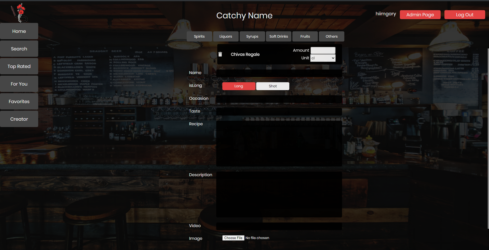
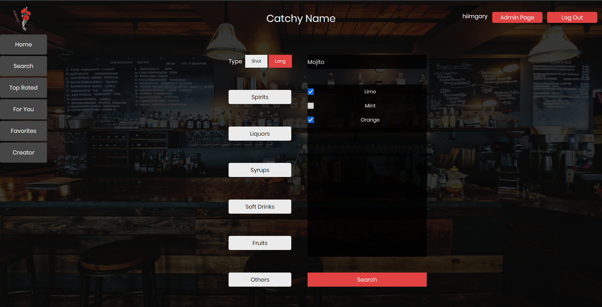
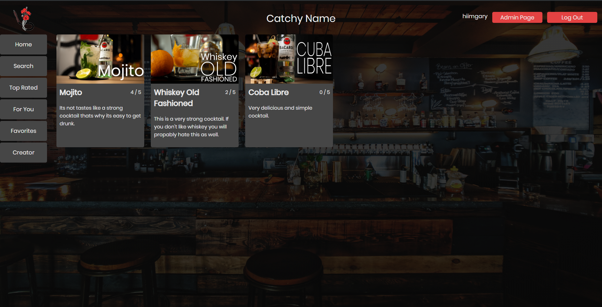
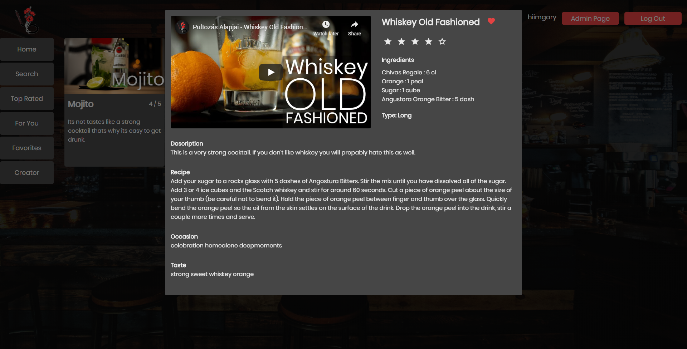
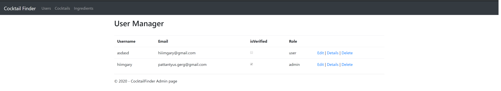
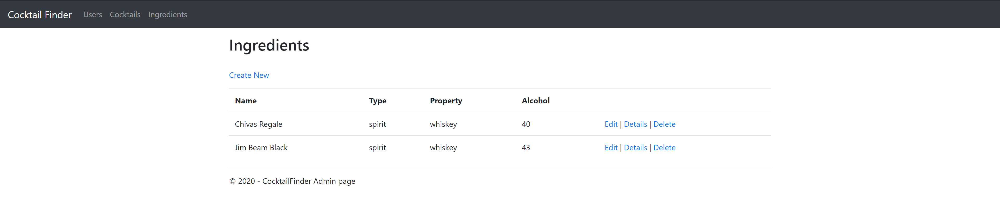

# Cocktail Finder 


## About

This web application is about cocktail recipes. You can search for your favorite beverages, see the recipe, the ingredients etc. You can access more features if you sign up. Once you created your account you will receive a confirmation e-mail and you have to verify your account. After logging in new tabs will appear on the navigation bar such as "For you", "Creator", "Favorites".


```
Creator Page
```

```
Search Page
```

```
Top Rated Page
```

```
Details Popup Window
```

### For You
```
If you liked cocktails the algorithm will give you drinks that you might like by comparing your taste to other users.
```

### Creator
```
You can create your own cocktails if you are a member of the site.
```

### Favorites
```
In this section you can see the cocktails that you liked.
```

## Admin Interface


```
The Application has a role system and administrators can access the Admin Interface where they can manage the users, add new ingredients.
```



## ChangeLog
```
2020.03.30
```
- Navigation bar
- Design
- Home Page
- First implementation of DB

```
2020.04.01
```
- Registry
- Log In
- Log Out
- Database updated with User Table
- User ViewModel created
- UserController created

```
2020.04.10
```
- After creating account e-mail sent to the users mail adress and has to verify the account
- Password hashing
- Some Security changes (cannot navigate to login/signup page when logged in)

```
2020.04.30
```
- Database altered (As there was 6 Tables for each kind of Ingredients but the same attribute and same connection I updated the tables.)
    - There are 5 tables
        - User
        - Cocktail
        - Ingredient
        - connect_ingredient_cocktail
        - connect_user_cocktail)
    - Easier to manage the records
- Added the Favorite, For you, Creator Navigation menus when logged in.
- ViewModel for Cocktails
- Cocktail Tile created.

```
2020.05.03
```
- Added new attribute to User table (Role)
- Roles Implemented
- Created ViewModel for Ingredients and Users
- AdminController created for the Admin interface
    - Only Admin can access (authorize)
    - Edit, Create new, Delete implemented for Ingredients
    - Delete, Edit implemented for Users  (<= Edit User not working yet for some reason)
- Cocktail, Ingredient, User Repositories created to access the database conviniently.

```
2020.05.06 - Hardest part so far...  
```
- Added new attribute to Ingredients table (units)
- Added new attribute to Cocktail table (Video)
- New ViewModel created for Creator page
- New Repository created for Creator page
- Prototype for Creator page (no SCSS, just logic)

```
2020.05.15 
```
- Creator Page finished, everything works as intended
- resultpage created for listing the cocktails
- image upload to db - image download from db
- youtube watchlink to embed function
- newly created cocktail only shown in the search results if an admin verifies it.

```
2020.05.23  
```
- Popup window created for viewing the details
- like function implemented
- User favorites implemented
- rating function implemented
- Top Rated Page implemented

```
2020.05.24 
```
- Search Page logic implemented
- search Result page done
- For You page implemented (Because of the lack of Users, it seaches for similar cocktails by taste)
- Fixed the issue with adminpage user editor.

```
2020.05.25 5:10 AM - The Project is Finished - (for now)
```


